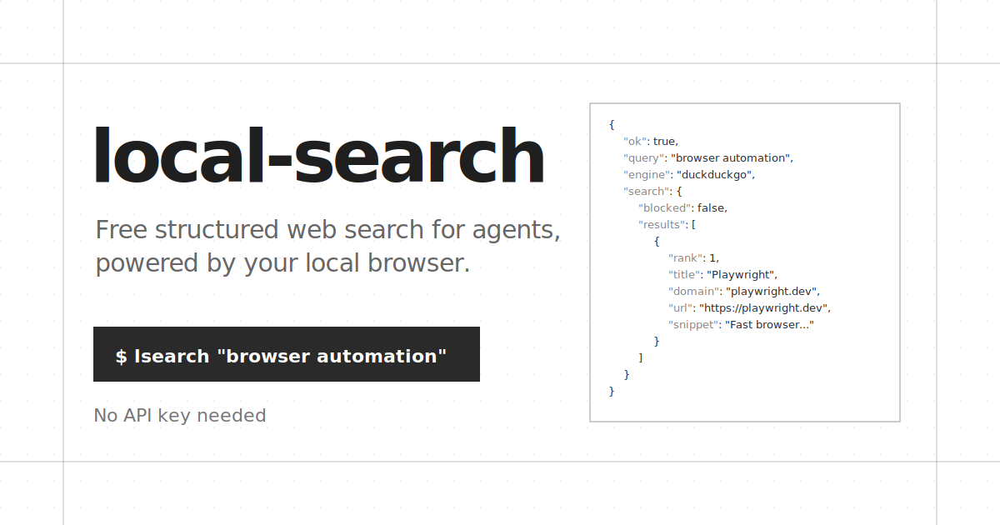

<p align="center">
  
</p>

# local-search

Free structured web search for agents, powered by your local browser.

```sh
lsearch "open source browser automation rust"
```

`local-search` gives agents Exa/Firecrawl/Brave/Tavily-style search, read, and
extract outputs without an API key or metered search bill. The primary CLI is
`lsearch`. It searches through a local Chrome/Chromium profile, so it can use the
same public web, logged-in sessions, cookies, and regional results you can see in
the browser.

## What You Get

- Search results as stable JSON, without Exa/Brave/Tavily-style metering.
- Optional result-page content extraction with `--with-content`.
- Local `read`, `extract`, `map`, `request`, screenshot, MHTML, HTML, and HAR-like
  capture commands.
- A managed Chrome profile that avoids repeated debugging prompts.
- `lsearch cleanup` so agents do not leave browser instances or stale profile
  markers behind.
- Compatibility binaries: `local-search` and `local-browser`.

## Install

```sh
cargo install local-search
```

For the latest unreleased build, install directly from GitHub:

```sh
cargo install --git https://github.com/Kevin-Liu-01/Local-Search
```

From a checkout:

```sh
cargo install --path . --force
lsearch doctor --pretty
```

Compatibility binaries are also installed:

```sh
local-search --help
local-browser --help
```

## Quick Start

Start the managed browser profile once:

```sh
lsearch launch
```

This opens a persistent Chrome profile owned by `local-search` at:

```txt
~/Library/Application Support/local-search/chrome-profile
```

Sign in to accounts there once if you want authenticated search/read/extract.
After that:

```sh
lsearch "latest rust cdp browser automation"
lsearch search "site:docs.rs tokio Runtime" --limit 5 --pretty
lsearch search "best browser search APIs for agents" --with-content --limit 3 --pretty
lsearch read https://example.com
lsearch extract "a[href]" --field title=text --field url=href --pretty
lsearch map https://example.com --depth 1 --limit 25 --pretty
lsearch cleanup --pretty
```

Agent-style flow:

```sh
lsearch search "agent broom github" --limit 1 --pretty
lsearch search "example domain" --limit 1 --with-content --content-chars 240 --pretty
lsearch map https://example.com --depth 1 --limit 10 --pretty
lsearch cleanup --kill --pretty
```

## Switching Search Engines vs Browsers

`lsearch` has two separate choices that are easy to mix up:

- Search engine: the search site queried inside the browser.
- Browser backend: the local browser automation transport used to load pages.

Search engines are switched with `--engine`. Google is the built-in default for
the fastest cold searches. Pass `--engine` when you want DuckDuckGo or Bing:

```sh
lsearch search "open source browser automation" --engine duckduckgo
lsearch search "open source browser automation" --engine google
lsearch search "open source browser automation" --engine bing
```

The shorthand form uses the default search engine:

```sh
lsearch "open source browser automation"
```

Matching searches reuse locally cached browser results for five minutes. This
makes repeated agent queries and depth changes return in a few milliseconds.
Use `--no-cache` for a fresh search, or change the window with `--cache-ttl`.
Search snippets are capped at 120 characters by default; `--snippet-chars`
changes that cap.

Browser backend is different. Today, `local-search` is built around
Chrome/Chromium's Chrome DevTools Protocol because it can control a normal local
profile. The recommended setup is still:

```sh
lsearch launch
```

To use a different Chromium-family app, pass its executable path when launching
the managed profile:

```sh
lsearch launch --browser-path "/Applications/Brave Browser.app/Contents/MacOS/Brave Browser"
lsearch launch --browser-path "/Applications/Microsoft Edge.app/Contents/MacOS/Microsoft Edge"
```

To attach to an already-running Chromium/CDP endpoint:

```sh
lsearch --cdp 9222 search "open source browser automation" --engine google
lsearch --cdp ws://127.0.0.1:9222/devtools/browser/... search "browser tooling" --engine duckduckgo
```

Safari is not currently a supported local signed-in browser backend. Safari's
official WebDriver automation uses isolated automation sessions, not the normal
profile state this project depends on. In practice: use Google, DuckDuckGo, or
Bing as the search engine inside a managed Chrome/Chromium profile; do not expect
`--browser safari` to reuse your normal Safari session.

## Token Benchmarks

`lsearch` keeps browser plumbing and full search-page snapshots out of the
agent's context. A source-build benchmark on 2026-07-21 measured visible command
text plus stdout with the `o200k_base` tokenizer. It ran 12 queries through the
same managed Chrome profile against DuckDuckGo, Google, and Bing, then compared
normalized search JSON with a compact interactive snapshot of the same rendered
results page.

| Results requested | Usable runs | Median `lsearch` tokens | Median snapshot tokens | Median paired reduction |
|---:|---:|---:|---:|---:|
| 3 | 36/36 | 309 | 8,760.5 | 96.5% |
| 10 | 36/36 | 891 | 8,708 | 89.8% |

All 72 cross-engine searches returned the requested number of results. A
separate DuckDuckGo stability check ran 12 queries five times each: 60/60
responses matched the output schema, and 58/60 returned the exact same top-three
URLs.

Content extraction was stress-tested across 24 three-result searches. All 72
result pages returned the full 1,200-character text cap, with zero command
failures and zero `about:blank` pages.

### Hosted Structured APIs

A second live benchmark ran the same queries and depths through `lsearch`, Exa,
Brave Search, Tavily, and Firecrawl. Each response was measured as returned, then
normalized to the common `rank`, `title`, `url`, and `snippet` fields. Exa used
highlights, Brave and Firecrawl used descriptions, Tavily used basic-search
content, and `lsearch` used its search snippets.

| Provider | Usable runs | Requested depth fulfilled | Median raw tokens | Median normalized tokens/result | Median latency | Full-run usage |
|---|---:|---:|---:|---:|---:|---:|
| **`lsearch`** | **24/24** | **24/24** | **413.5** | **53.4** | **148.7 ms** | **$0** |
| Exa | 24/24 | 24/24 | 4,472.5 | 881.2 | 501.9 ms | $0.324 |
| Brave Search | 24/24 | 24/24 | 13,104 | 108.6 | 322.0 ms | $0.120 |
| Tavily | 24/24 | 17/24 | 1,163 | 259.5 | 1,184.4 ms | 24 credits ($0.192 PAYG) |
| Firecrawl | 24/24 | 24/24 | 509 | 74.8 | 1,520.8 ms | 48 credits |

`lsearch` was the fastest provider and returned the fewest raw and normalized
tokens in this comparison while spending zero API credits. The matched workload
contains 12 cold three-result searches followed by the same 12 queries at ten
results. `lsearch` retained the full browser result set locally, so the second
depth completed from its five-minute cache: cold median 384.5 ms, warm median
6.5 ms. The full methodology and runner live in
[`benchmarks/`](benchmarks/README.md).

## Why This Exists

Agent search is dominated by paid or hosted APIs:

- [Exa](https://exa.ai/docs/reference/search) offers search plus extracted
  contents/highlights and deeper research modes.
- [Firecrawl](https://docs.firecrawl.dev/api-reference/v2-introduction) offers
  search, scrape, crawl, map, extract, and agentic web data features.
- [Brave Search API](https://api-dashboard.search.brave.com/documentation)
  exposes Brave's independent index, including LLM-oriented context endpoints.
- [Tavily](https://docs.tavily.com/documentation/api-reference/introduction)
  offers search, extract, crawl, and research APIs for agents.

Those are useful production services. `local-search` is for the cases where an
agent should use the browser already on the machine and spend zero API credits.

The browser-tooling neighbors are different:

- [browse.sh](https://browse.sh/) / Browserbase Browse CLI is a broader browser
  skills and browser automation surface.
- [agent-browser](https://github.com/vercel-labs/agent-browser) is an
  agent-first browser automation CLI with snapshots, refs, tabs, forms, and
  network tools.
- [browser-use CLI](https://docs.browser-use.com/open-source/browser-use-cli)
  gives coding agents direct browser control using local or cloud browsers.
- [AgentWebSearch](https://mcpmarket.com/server/agentwebsearch) is the closest
  local-search neighbor: local LLM web search through real Chrome/CDP.

`local-search` keeps the browser controls, but frames them as search
infrastructure.

## Comparison

| Tool | Primary job | Hosted/API key | What local-search optimizes for |
|---|---|---:|---|
| Exa | AI-native web search, contents, highlights, deep search | Yes | Zero-cost local search and browser-session auth |
| Firecrawl | Search, scrape, crawl, map, extract at scale | Hosted or self-hosted | Single-machine agent search without service setup |
| Brave Search API | Independent search index and LLM context | Yes | Consumer search surfaces through your own browser |
| Tavily | Search/extract/crawl/research APIs | Yes | No account, no metered usage, local browser state |
| browse.sh / Browse CLI | Browser skills and browser/cloud automation | Optional cloud | Search-first CLI with paid-search replacement framing |
| agent-browser | General browser automation for agents | No | Structured search/read/extract as the main product |
| browser-use CLI | Agent browser control via Python workflows | Optional cloud | Native Rust, JSON-first search API replacement |
| AgentWebSearch | Local Chrome search for LLMs | No | CLI-first structured outputs plus extraction/artifacts |

## Commands

Search:

```sh
lsearch "hi"
lsearch search "open source browser automation rust" --limit 10
lsearch search "firecrawl alternatives" --engine duckduckgo --with-content --limit 5
```

Google is the default engine for speed. DuckDuckGo and Bing remain available
with `--engine duckduckgo` and `--engine bing`.

Read and extract:

```sh
lsearch read https://example.com --format markdown
lsearch read https://example.com --format json --pretty
lsearch extract "article" --field title="h1=>text" --field url="a=>href"
```

Map a site locally:

```sh
lsearch map https://docs.rs --depth 1 --limit 50 --pretty
```

Authenticated browser fetch:

```sh
lsearch request https://example.com/api/me --header "Accept: application/json" --pretty
```

Artifacts:

```sh
lsearch screenshot artifacts/page.png --full-page
lsearch mhtml artifacts/page.mhtml
lsearch record https://browse.sh/ --har artifacts/browse.har --mhtml artifacts/browse.mhtml
```

Browser primitives for debugging workflows:

```sh
lsearch snapshot --pretty
lsearch click @e3
lsearch fill "input[name=q]" "local search cli"
lsearch press Enter
```

## Output Contract

Successful structured commands return:

```json
{ "ok": true, "...": "..." }
```

Failures are JSON on stderr:

```json
{ "ok": false, "error": { "code": "browser_not_found", "message": "..." } }
```

Human-readable `read --format markdown`, `read --format text`, and `html`
without a path write raw content to stdout.

## Agent Hygiene

`lsearch` is designed to be called by agents repeatedly. Use:

```sh
lsearch cleanup --pretty
```

to inspect the managed browser state, and:

```sh
lsearch cleanup --kill --pretty
```

when the task is done and the managed browser should be stopped. Cleanup only
targets the managed local-search browser listener and stale profile marker files;
it does not delete cookies, history, or profile data.

## Browser Setup

Recommended:

```sh
lsearch launch
lsearch cleanup --pretty       # dry-run managed browser cleanup
lsearch cleanup --kill         # stop managed browser and clear stale markers
```

This avoids Chrome's default-profile remote debugging prompts by using a
separate persistent `local-search` profile. You can still attach to an existing
endpoint when needed:

```sh
lsearch --cdp 9222 doctor
lsearch --cdp ws://127.0.0.1:9222/devtools/browser/... tabs list
```

Agents can call the cleanup wrapper directly:

```sh
scripts/local-search-cleanup.sh --pretty
scripts/local-search-cleanup.sh --kill --pretty
```

Safari is intentionally limited. Its official WebDriver automation uses isolated
automation sessions, not the normal signed-in browsing profile this project
targets.
