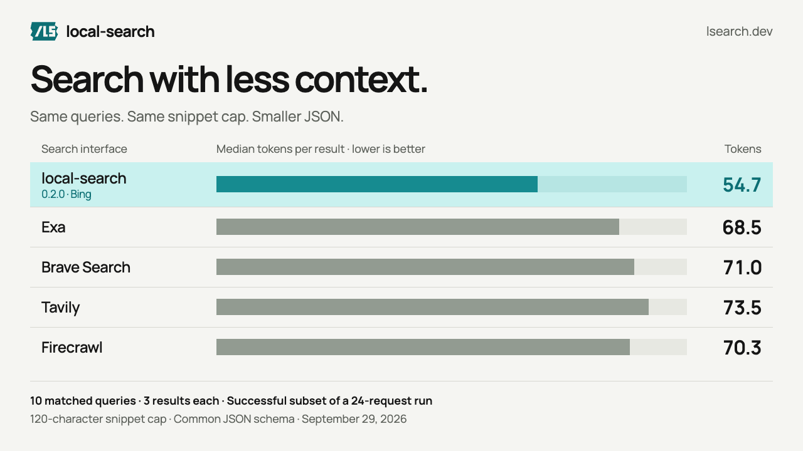

# Search benchmark

Recorded September 29, 2026 (Pacific). Published **local-search 0.2.0**, Bing,
Chrome 154.0.8037.92, arm64 macOS (Darwin 25.4.0).

## Agent context



All five providers returned valid results for **ten of the same query/depth
pairs**. Those ten three-result queries form the chart, not different successful
subsets for each provider.

| Interface | Median tokens per result |
| --- | ---: |
| local-search 0.2.0, Bing | 54.7 |
| Exa | 68.5 |
| Brave Search API | 71.0 |
| Tavily | 73.5 |
| Firecrawl | 70.3 |

Each result uses the same `rank`, `title`, `url`, and `snippet` JSON fields.
Snippets are capped at 120 characters for **every provider**. Tokens include
one common `{query, limit}` request and the normalized response, divided by the
returned result count. The tokenizer is `o200k_base` (tiktoken 0.14.0).

Equal maximum length does not mean equal information, ranking, or relevance.
This measures serialized context size, not answer quality. Actual CLI output
also contains its success envelope, domain, and engine metadata; its token
counts are recorded separately as `stdout_tokens`.

## Full request set

Twelve queries at depths 3 and 10, or 24 planned requests per interface.
All failures remain in the source data.

| Interface | Valid responses | Requested depth fulfilled | Outcome |
| --- | ---: | ---: | --- |
| local-search, Bing | 24/24 | 24/24 | All requested depths returned |
| Exa | 21/24 | 21/24 | Three responses failed the title/HTTP(S)-URL validator |
| Brave Search API | 24/24 | 24/24 | All requested depths returned |
| Tavily | 24/24 | 20/24 | Four responses contained fewer results than requested |
| Firecrawl | 10/24 | 10/24 | Fourteen HTTP 429 responses |

Firecrawl's partial run is why the common subset contains only ten three-result
queries. No quality or general reliability ranking follows from these counts.
The runner sent the original sequential workload without rate-limit retries.

Provider settings: Exa `type: fast` with highlights; Brave web search;
Tavily basic search without generated answers or raw content; Firecrawl web
search without page scraping. Exact request settings live in
[`hosted_search.py`](hosted_search.py).

## Latency and cache

The machine was under heavy load during this run. Observed one-minute load
averages ranged from roughly 529 during initial setup to 343 after the measured
runs. **These timings are not a controlled provider speed ranking.**

| Interface / mode | Successful samples | Median wall time |
| --- | ---: | ---: |
| local-search, Bing, empty local cache | 24 | 442.7 ms |
| local-search, Bing, verified cache reuse | 24 | 172.4 ms |
| Exa | 21 | 472.7 ms |
| Brave Search API | 24 | 408.9 ms |
| Tavily | 24 | 1,329.2 ms |
| Firecrawl | 10 | 1,180.5 ms |

The table includes every successful request per interface, **not** the matched
chart subset. Local uncached p95 was 2,867.8 ms; cached p95 was 1,032.0 ms.
Failures are excluded from latency calculations and listed above.

Local timing includes CLI startup, connection, navigation, extraction, and
output. Browser launch is excluded. Each query/depth starts with an empty
local-search cache, then repeats once. Cache reuse requires identical results
and existing, unchanged cache files. Browser/OS caches are not flushed. Hosted
timing includes the HTTP request and response download. Runs are sequential,
not randomized, and were launched as separate local and hosted jobs on the same
machine. Network, ordering, system contention, and provider-side caches remain
confounders. These numbers should not support a "fastest" claim.

## Browser outcomes

The initial four-engine run had Chrome startup timeouts for Bing, Google, and
Brave. DuckDuckGo started, but its first search was blocked; remaining requests
were skipped without retrying or bypassing verification. A subsequent Bing-only
run started successfully and completed all 24 uncached/cache pairs.

Both successfully launched profiles returned an `invalid_argument` cleanup
status. A later process inspection found no remaining Chrome main processes
using either owned benchmark profile path. The reports retain the cleanup
failures and nonzero runner outcomes. No personal profile was accessed.

## Reproduce

Install the published release into an isolated directory:

```sh
cargo install local-search --version 0.2.0 --locked \
  --root artifacts/benchmark-release --bin lsearch
python3 -m venv artifacts/benchmark-env
artifacts/benchmark-env/bin/pip install tiktoken==0.14.0
```

Run the local engine test with fresh temporary profiles and caches:

```sh
artifacts/benchmark-env/bin/python benchmarks/search.py \
  --binary artifacts/benchmark-release/bin/lsearch --engines bing \
  --output artifacts/search.json
```

Place provider keys in ignored `.env.bench.local`, never in commands or reports:
`EXA_API_KEY`, `BRAVE_SEARCH_API_KEY`, `TAVILY_API_KEY`, `FIRECRAWL_API_KEY`.
Hosted calls can incur charges.

```sh
artifacts/benchmark-env/bin/python benchmarks/hosted_search.py \
  --providers exa,brave,tavily,firecrawl --include-rows \
  --output artifacts/hosted-search.json
artifacts/benchmark-env/bin/python benchmarks/comparison.py \
  --local artifacts/search.json --hosted artifacts/hosted-search.json \
  --output artifacts/comparison.json
```

The chart source reads the committed comparison JSON. After deliberately
replacing the source reports and rebuilding that comparison file, render with
`node scripts/render-chrome-demo.mjs --benchmark-only`. This does not re-render
the demo GIF. Desktop and mobile PNGs have automated layout checks.

## Evidence

- [Initial four-engine run](results/search-2026-09-29.json)
- [Completed Bing search run](results/search-2026-09-29-bing.json)
- [Hosted-provider requests](results/hosted-search-2026-09-29.json)
- [Matched chart data](results/search-comparison-2026-09-29.json)
- [Editable chart](../docs/launch/benchmark-card.html)

The local binary came from crates.io, not the repository build. Its SHA-256 was
`dbe4217c240391e375e540917b8220e8d9479823bfbf02ba9e504800a19cce58`, unchanged
after testing; file size was 1,255,776 bytes. Reports contain measurements and
public query strings, not response bodies, credentials, cookies, or account data.
The hosted report retains explicitly dated July 21 pricing estimates for
historical compatibility. **They are not current prices or invoices and are
not used in this chart or README.**
